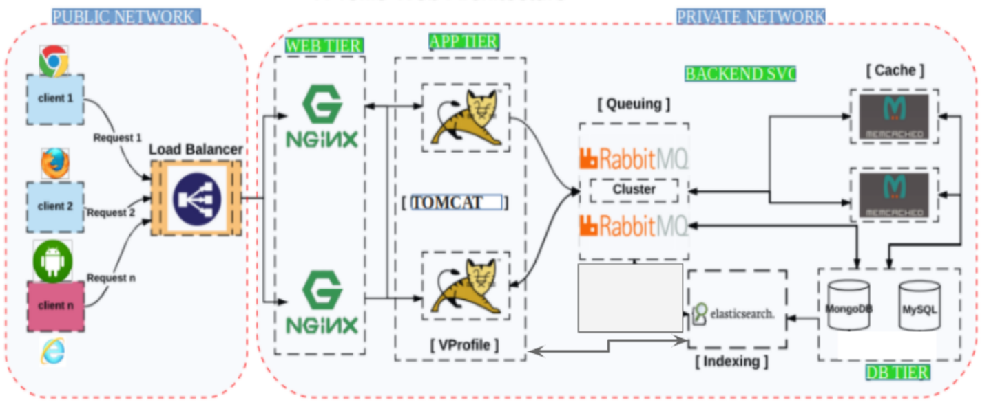

# Manual Web Stack

This creates the stack reqiured for setting up the java project on the local machine using Vagrant and VirtualBox.

### Prerequisites
- Vagrant
- VirtualBox

### System Design

### Steps
All the steps to follow are documented in he pdf.

