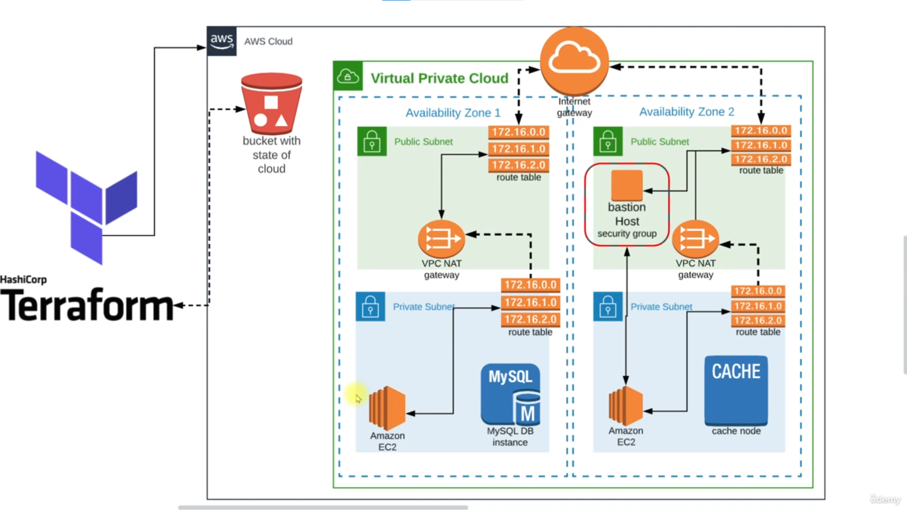
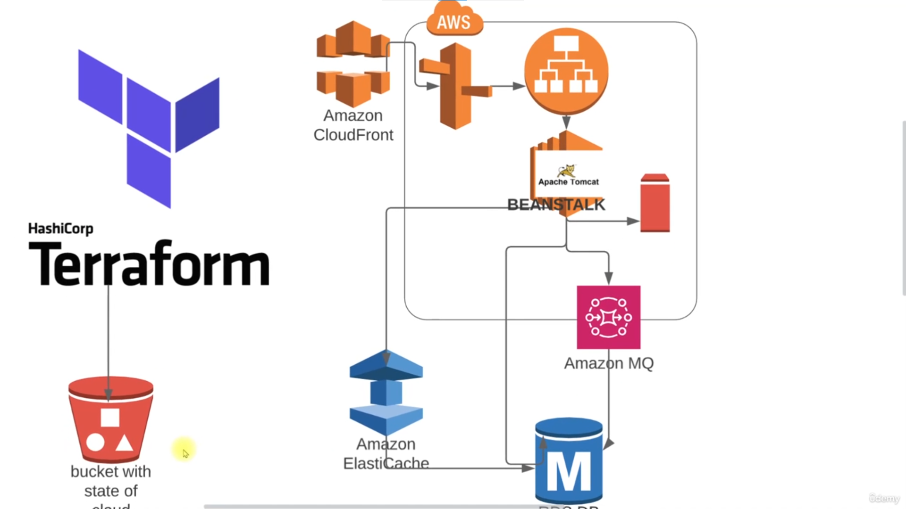

# AWS Beanstalk

This creates the stack reqiured for setting up the java project on the AWS Beanstalk env and uses AWS services like RDS, Memcache & AmazonMQ, all of which are created through Terraform provisioning (IaaC)  .

### Prerequisites
- AWS CLI
- Terraform
- Bash Scripting
- VPC (Networking)

### System Design

### Terraform IAAC

