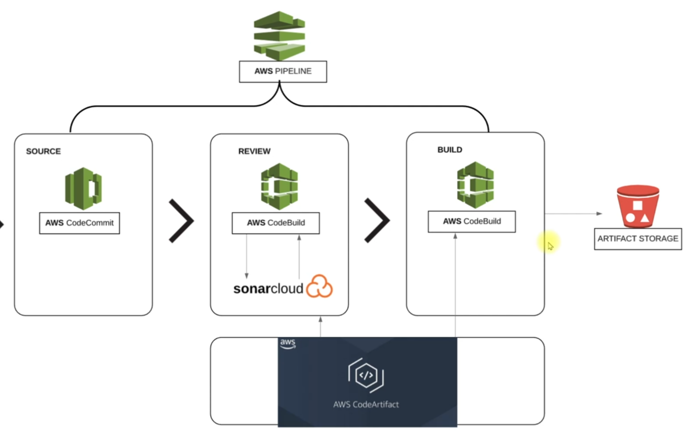

# AWS CI

This Repo Creates a pipeline using AWS developer tools which stores, builds & test the code using codecommit and code build,
stores the **.war Artifact using codeartifact.

### Prerequisites
- AWS
- Terraform
- AWS Code Commit
- AWS Code Build
- AWS Code Artifact
- AWS Code Deploy
- AWS Code pipeline
- AWS SNS 
- Sonar Cloud

### System Design

