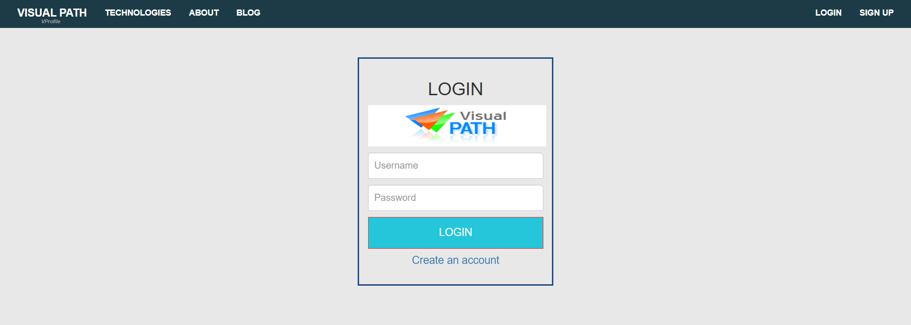
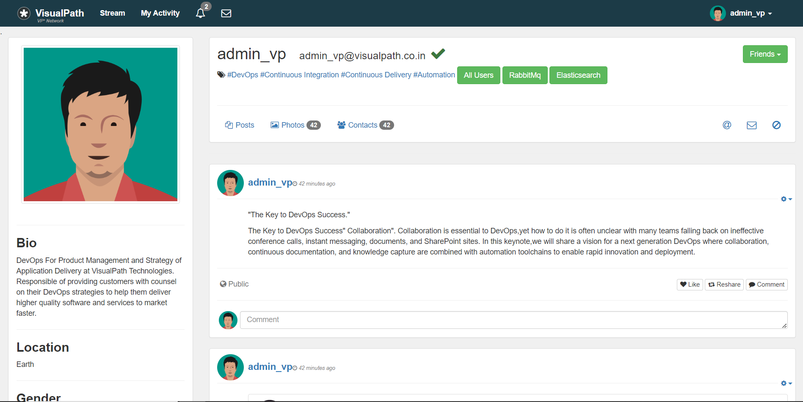

# DevOps Projects

This Repository is a collection of DevOps Projects done on a sample Java Microservice app containing services like MySQL, Memcache, RabbitMQ and Tomcat application server.

### Tools and Technology
The knowledge about the following Tools are required in the Projects:-
- Vagrant, VirtualBox
- Bash Scripting
- Jenkins 
- Ansible 
- Terraform
- AWS (IAM, EC2, RDS, S3, VPC, Beanstalk, Code Deploy/Pipelines, Route53, Elasticache, AmazonMQ, SNS, Grafana, ECR & EKS)
- Docker
- Docker Compose
- Kubernetes
- KOPS/Minikube (any kind of cluster Delpoyment)
- Maven
- Git (Github)

## Screenshots
#### Login 
This page checks for the credentials in the mysqldb.
Default user_name and password are "admin_vp".

#### Profile 
This page comes after logging in and consists of button for checking connectivity and functioning of Memcache, RabbitMQ and Elasticsearch.

 

#### Users
By clicking on this button, you will redirected to a list of users. On clicking any user_id for he first time it wiil be loaded from the database into Cache and it will say so on the page, And on clicking the same user again it's details will be loaded from cache.

#### RabbitMQ
This button will check the connectivity and functionality of the RabbitMQ service.

## List of Projects
The sample Java project was setup in multiple ways including local machine setup and AWS setup.
### 01 Manual Setup
- Setup in virtual linux windows using vagrant.
- 5 different machines were setup individually and then configured.
- Further Information - link
### 02 Automated Setup
- Setup in virtual linux windows using vagrant.
- 5 different machines were setup and configured using Automation.
- Further Information - link
### 03 AWS Web Stack
- Setup on AWS EC2 instances using Terraform.
- 4 different machines were setup and configured using Terraform provisioning.
- Route53 hosted zone was used as a DNS and a load Balancer was used.
- Further Information - link
### 04 AWS Native Stack
- Setup on Amazon Beanstalk env using Terraform.
- Private VPC and subnets were setup. 
- Application was Configred to run on Beanstalk Env using Amazon RDS, AmazonMQ and AWS Elasticache.
- Further Information - link
### 05 Jenkins CI 
- A Pipeline was setup using Jenkins to build, test and store the artifact.
- Artifact was build using maven , tested on Sonarqbe and stored using Nexus Repo.
- Further Information - link
### 06 AWS CI 
- A Pipeline was setup using AWS developer tools to build, test and store the artifact.
- CodeCommit, CodeBuild, CodeArtifact, CodePipeline were setup and configured using Terraform.
- Further Information - link
### 07 CD of Java Web App
- A Pipeline was setup using Jenkins to build, test, store the artifact and Deploy it.
- Artifact was build using maven , tested on Sonarqbe, stored using Nexus Repo & Deployed on AWS Beanstalk.
- Further Information - link
### 08 CD of Java Web App on AWS
- A Pipeline was setup using AWS developer tools to build, test, store the artifact and Deploy it .
- CodeCommit, CodeBuild, CodeArtifact, CodePipeline & CodeDeploy were setup and configured using Terraform.
- Further Information - link
### 09 Containerization of Java Web App
- Application was build into 5 microservices nd orchestrated using Docker-Compose. 
- 5 different Containers were configured and ran on docker desktop.
- Further Information - link
### 10 Kubernetes Deployment 
- Application was build into 5 microservices nd orchestrated using Kubernetes. 
- 5 different Containers were ran on KOPS(AWS)/Minikube(Local).
- Further Information - link
